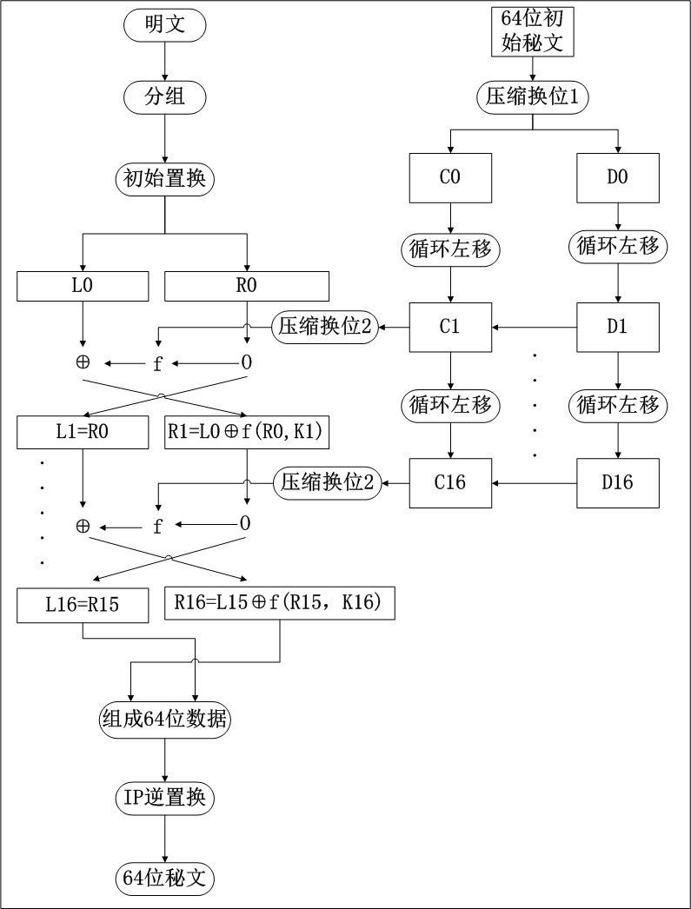

# Lab2 DES 算法的加密与解密

> 1613573 秦浩翔

## 实验目的

通过对 DES 算法对实际数据进行加密来深刻了解 DES 的运行原理。

## 实验内容

### 加密过程

首先将待加密消息以 64 位分组，接着进行初始置换。接着将变换后的数据平分为左右两部分 $$L_0, R_0$$，然后对 $$R_0$$ 实现在子密钥控制下的 $$f$$ 变换，而后 $$L_1 = R_0, R_1 = L_0 \oplus f(R_0, K_1)$$，经过这样的共 16 轮运算后生成 $$L_{16}, R_{16}$$。以 $$R_{16}, L_{16}$$ 的顺序组成 64 位数据后进行初始置换的逆置换，得到 64 位密文。



### 密钥生成

初始由用户输入 64 位的密钥，经过置换操作后得到 56 位的子密钥，按左右分为$$C_0, D_0$$，循环左移后经过压缩置换操作第一轮的子密钥 $$K_1$$ ，如此反复得到 16 轮 48 位子密钥。

### f 函数

f 函数接收 32 位的数据和 48 位的子密钥输入，首先通过 $$E$$ 表进行扩展置换，将输入的 32 位数据扩展为 48 位。再与子密钥进行异或运算，得到的数据分成 8\*6 位的块，每一块通过对应的 $$S$$ 表产生一个 4 位的输出，共得到 32 位的数据。数据通过 $$P$$ 表置换后得到 32 位的输出。

### 算法实现

使用 bitset 数据结构处理数据。

#### 子密钥生成

```c++
DES::DES(b64 k) : k(k)
{
	b56 k_0;
	b28 k_c,k_d;
	b56 key;
	// PC_1置换
	k_0=permutation<64, 56>(k, PC_1);
	k_c = (k_0 >> 28).to_ullong() ;
	k_d = (k_0 << 28 >> 28).to_ullong();

	for (int round = 1; round <= 16; round++){
		k_c = movemove(k_c, movetimes[round]);
		k_d = movemove(k_d, movetimes[round]);

		for (int i = 28; i<56; ++i)
			key[i] = k_c[i - 28];
		for (int i = 0; i<28; ++i)
			ley[i] = k_d[i];
		// 循环移位后经过 PC_2 置换得到每一轮的子密钥
		finalKey[round] = permutation<56, 48>(key, PC_2);
	}
}
```

#### f 函数

```C++
// f 函数
b32 DES::f(b32 R, int E[48], b48 key, int S_Box[8][4][16])
{
	b32 temp;
	// 32 位数据先经过 E 表置换成 48 位
	b48 e_per = permutation<32, 48>(R, E);
	// 置换得到数据与子密钥疑惑
	b48 num_xor = e_per ^ key;
	b32 S;
	int x = 0;
	// S 盒映射
	for (int i = 0; i< 48; i = i + 6)
	{
		int row = num_xor[47 - i] * 2 + num_xor[47 - i - 5];
		int col = num_xor[47 - i - 1] * 8 + num_xor[47 - i - 2] * 4 + num_xor[47 - i - 3] * 2 + num_xor[47 - i - 4];
		int num = S_Box[i / 6][row][col];
		bitset<4> binary(num);
		S[31 - x] = binary[3];
		S[31 - x - 1] = binary[2];
		S[31 - x - 2] = binary[1];
		S[31 - x - 3] = binary[0];
		x += 4;
	}
	// P表置换
	temp = permutation<32, 32>(S, P);
	return temp;
}
```

#### 加密过程

```C++
// 加密
b64 DES::des_encrypt(b64 m)
{
	b64 m_0;
	b32 m_l, m_r;
	b64 result;
	b64 finalresult;
	// 初始 IP 置换
	m_0 = permutation<64, 64>(m, IP_1);
	m_l = (m_0 >> 32).to_ullong();
	m_r = (m_0 << 32 >> 32).to_ullong();
    // 16 轮 f 函数
	for (int round = 1; round <= 16; round++)
	{
		b32 temp;
		temp=m_l ^ f(m_r, E, finalKey[round], S_Box);
		m_l = m_r;
		m_r = temp;
	}
	for (int i = 0; i<32; ++i)
		result[i] = m_l[i];
	for (int i = 32; i<64; ++i)
		result[i] = m_r[i - 32];
	// 逆置换
	finalresult = permutation<64, 64>(result, IP_2);
	return finalresult;
}
```

#### 解密过程

解密过程与加密过程类似

```C++
// 解密
b64 DES::des_decrypt(b64 c)
{
	b64 c_0;
	b32 c_l, c_r;
	b64 result;
	b64 finalresult;
	c_0 = permutation<64, 64>(c, IP_1);
	c_l = (c_0 >> 32).to_ullong();
	c_r = (c_0 << 32 >> 32).to_ullong();
	for (int round = 1; round <= 16; round++){
		b32 temp;
		temp = c_l ^ f(c_r, E, finalKey[17-round], S_Box);
		c_l = c_r;
		c_r = temp;
	}
	for (int i = 0; i<32; ++i)
		result[i] = c_l[i];
	for (int i = 32; i<64; ++i)
		result[i] = c_r[i - 32];
	finalresult = permutation<64, 64>(result, IP_2);
	return finalresult;
}
```
