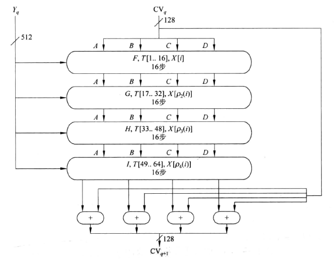

# Lab5 Hash 函数 MD5

## 实验目的

通过实际编程了解 MD5 算法的过程，加深对 Hash 函数的认识。

## 实验内容

Hash 函数是将任意长的数字串转换成一个较短的定场输出字符串的函数，具有如下特点：

1. 快速性：对于任意一个输入值 $x$，有 Hash 函数 $H(x)$，计算 Hash 值 $y$，即 $y = H(x)$，是非常容易的。
2. 单向性：对于任意一个输出值 $y$，希望反向推出输入值 $x$，使得 $y =H(x)$ ，是非常困难的。
3. 无碰撞性：一个好的 Hash 函数应该满足强无碰撞性，即找到两个不同的数字串 $x$ 和 $y$，满足 $H(x)= H(y)$，在计算上是不可能的。

MD5 算法对任意长度的输入值处理后产生 128 位的 Hash 值。

### 算法步骤

1. 信息填充，使其位长度与 488 模 512 同余，即信息的字节长度扩展至 $n \times 512 + 448$。填充方式为第一位填 1，其余各位均为 0。然后再在结果后面附加一个以 64 位表示的填充前信息长度。经过处理的信息长度为 512 的整数倍。

2. MD5 中有 4 个 32 位整数参数 A、B、C、D 作为链接变量，设置好 4 个链接变量后，开始进入算法的 4 轮循环运算。循环的次数是信息中 512 位信息分组数目。

3. 然后进入主循环，有 4 轮，每轮循环都很相似。第一轮进行 16 次操作，每次操作对 4 个变量中的三个做一次非线性函数运算，然后将得到的结果加上第四个变量，文本的一个 32 位子分组和一个常数。再将所得结果向左循环移 S 位，并加上 A、B、C、D 其中之一。最后用该结果取代 A、B、C、D 其中之一。

4. 每次操作中用到的 4 个非线性函数：
   $$
   F(X,Y,Z) = (X\wedge Y) \vee (\bar{X} \wedge Z)\\
   G(X,Y,Z) = (X\wedge Z) \vee (Y \wedge \bar{Z})\\
   H(X,Y,Z) = X \oplus Y \oplus Z\\
   I(X,Y,Z) = Y \oplus (X \vee \bar{Z})
   $$
	
    MD5 轮主要操作为：
   $$
   a = b + ((a+f(b,c,d)+M+s)<<<t)
   $$
   
   
   对应于四轮操作，$f$ 分别取 $F,G,H,I$；对每一轮的 16 次运算，$M$ 分别取 $M_1,M_2,···M_{16}$。对于 4 轮共 64 次运算，$t$ 为给定的一些常数，另一个常数 $s(i)$ 是 $2^{32} \times abs(sin(i))，i \in [1,64]$ 的整数部分，由此构成了 32 位的随机数源 $s(i)$。
   
   

MD5 算法的流程图如下：



### 算法实现

代码比较简单，使用 uint8_t 类型处理数据，主要需要注意要用小端存储。

```C
// 小端 
void to_bytes(uint32_t val, uint8_t *bytes) {
    bytes[0] = (uint8_t) val;
    bytes[1] = (uint8_t) (val >> 8);
    bytes[2] = (uint8_t) (val >> 16);
    bytes[3] = (uint8_t) (val >> 24);
}
```

MD5 函数的流程，即信息填充以及分组处理：

```C
// 信息填充
    for (new_len = initial_len + 1; new_len % (512/8) != 448/8; new_len++) ;
    msg = (uint8_t*)malloc(new_len + 8);
    memcpy(msg, initial_msg, initial_len);
    msg[initial_len] = 0x80;
    for (offset = initial_len + 1; offset < new_len; offset++)
        msg[offset] = 0;
    // 填充后把原始的长度以 64 位小端接在后面
    to_bytes(initial_len*8, msg + new_len);
    to_bytes(initial_len>>29, msg + new_len + 4);
    // 以 512 位为单位处理数据
    for(offset=0; offset<new_len; offset += (512/8)) {
        // 512 位再分成 32 位 * 16 组
        for (i = 0; i < 16; i++)
            w[i] = to_int32(msg + offset + i*4);
        // 链接变量
        a = h0;
        b = h1;
        c = h2;
        d = h3;
        // 主循环
        for(i = 0; i<64; i++) {
            if (i < 16) {
                f = (b & c) | ((~b) & d);
                g = i;
            } else if (i < 32) {
                f = (d & b) | ((~d) & c);
                g = (5*i + 1) % 16;
            } else if (i < 48) {
                f = b ^ c ^ d;
                g = (3*i + 5) % 16;          
            } else {
                f = c ^ (b | (~d));
                g = (7*i) % 16;
            }
            temp = d;
            d = c;
            c = b;
            b = b + LEFTROTATE((a + f + k[i] + w[g]), r[i]);
            a = temp;
        }
        h0 += a;
        h1 += b;
        h2 += c;
        h3 += d;
    }
```

